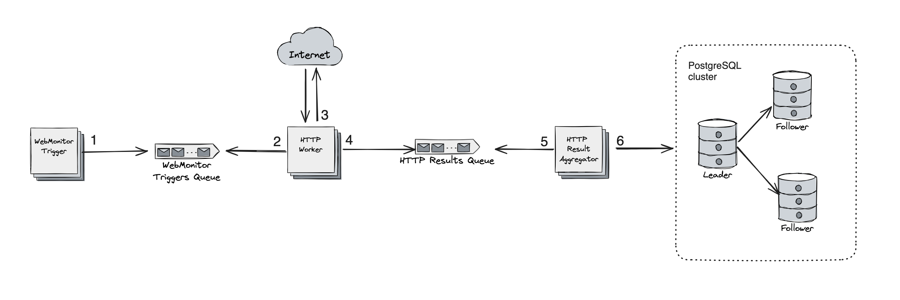

# Project Name
Web Monitors App

## Description
The app monitors the availability of configured websites over the network, produces `response_time` metrics, and stores the metrics in the PostgreSQL database.

## App Design


**Main components:**
- WebMonitor Trigger: This component functions as a background job responsible for periodically initiating website checks. It achieves this by enqueuing a configured HTTP URL in the Triggers Queue. 
- WebMonitor Triggers Queue: This component manages a queue of events generated by the WebMonitor Trigger. Events are consumed by the HTTP Worker.
- HTTP Worker: This component consumes events from the Triggers Queue, sends an HTTP request, applies a regex pattern if required, and enqueues the result into the HTTP Results Queue.
- HTTP Results Aggregator: creates a batch from HTTP results and saves the batch into PostgreSQL.

These components serve as the fundamental building blocks of the application, working together to achieve the app goal at high performance.

**How many HTTP checks a single instance of the app can serve?**
- assuming the response time of an average HTTP request is 200ms (based on benchmarks of HTTP req traveling from North America to Europe)
- a single thread can fulfill 5 requests in one second and 25 requests in 5 seconds
- assuming the app is deployed on a server with 36 cores (72 hardware threads), 72 * 5 = 360 HTTP checks every second possible 

**Database**

Database scheme defined in `db/create_db.sql` script. Utilize this script to create DB in `prod`.

**Storage estimation**
- assuming the system checks 10,000 URLs every minute
- 10*10^3 * 60 * 24 = 15 * 10^6 new records daily saved in `metrics` table
- single record size = 8 bytes + 60 bytes + 4 bytes + 4 bytes + 100 bytes = 176 bytes
- 15 * 10^6 * 176 = 2640 * 10^6 = 2.5 * 10^9 bytes = 2.5 GB daily / 75 GB monthly / 1 TB yearly

In favor of reading/writing performance `metrics` table is partitioned by the `request_timestamp`. Consistent hashing is not considered at the current stage.

## APP Configuration
The HTTP URLs monitored by the app are configured in the `urls.config.{env_name}.json` file. 
Additionally, further settings can be adjusted through environment variables specified in the `.env.{env_name}` file. 
Some key variables include::
- `HTTP_CHECK_DEFAULT_TIMEOUT`: Sets the timeout for HTTP requests
- `HTTP_WORKERS_NUMBER`: Determines the number of HTTP worker threads the app initializes upon startup. The appropriate value is based on the assessment of the number of websites to be monitored.
- `RESULT_AGGREGATORS_NUMBER`: Specifies the number of aggregator threads responsible for buffering HTTP results and executing `INSERT` queries within the PostgreSQL cluster.
- `RESULT_AGGREGATOR_BATCH_SIZE`: Defines the size of the batched HTTP results inserted into PostgreSQL as a single query.

## How to Run
Python 3.12.2 was used to build the app. The app can be launched locally in `qa` or `prod` environment

**QA configuration (local setup)** 
1. Navigate to the project root directory:
```
cd web-monitors
```
2. Setup Python [virtual environment](https://docs.python.org/3/library/venv.html)
```
python3 -m venv env
```
3. Activate environment:
```
source env/bin/activate
```
4. Install packages:
```
python3 -m pip install -r requirements.txt
```
5. Run dependencies in Docker. It launches PostgreSQL and [MockServer](https://www.mock-server.com/):
```
docker compose up
```
6. Run the app:
```
python3 -m app.main
```  
**PROD environment**
The app should be distributed as a Docker image but it's possible to run the app locally in `prod` configuration:
1. Follow the steps above to create a Python virtual environment and restore all packages.
2. Create PostgreSQL Database `web_monitors_db` in your cloud.
3. Use `db/create_db.sql` to create tables.
4. Create `web_monitors_app` user in your PostgreSQL cluster.
5. Grant `INSERT` permissions for the new user:
```
GRANT INSERT
    ON metrics
    TO web_monitors_app;

GRANT INSERT
    ON errors
    TO web_monitors_app;
```
6. Adjust Database settings in the environment file `.env.prod`.
7. Set `ENV` var to `prod`:
```
export ENV=prod
```
8. Adjust `LOG_LEVEL` severity, by default it's `DEBUG` but should be changed to `INFO` when the app is stable.
9. Configure which URLs should be checked in `urls.config.prod.json`
10. Run the app:
```
python3 -m app.main
```
## How to Test
The app functionality is covered with unit and integration tests.
To execute tests, follow QA steps above but instead of running the app at step 8, run `pytest` command.


